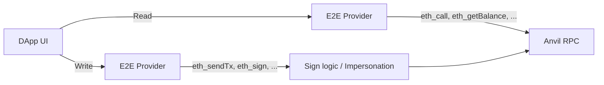

# @wonderland/walletless

[](https://www.npmjs.org/package/@wonderland/walletless)

Lightweight E2E Provider for Web3 DApps - A virtual EIP-1193 provider that enables deterministic, high-performance E2E testing.

## Overview

This library provides a **man-in-the-middle injected provider**. Your DApp keeps using the EIP-1193 interface, while reads go to [Anvil](https://getfoundry.sh/anvil/reference) and writes are signed locally.

### How It Works



**Read operations** (`eth_call`, `eth_getBalance`, …) → forwarded to Anvil RPC  
**Write operations** (`eth_sendTransaction`, `eth_sign`, …) → signed locally, then sent to Anvil  
You get production-realistic chains with test-level control.

## Advantages

-   **Incredible Test Speed**: No browser extension overhead, controlled RPC latency, fully virtualized wallet interactions
-   **Framework Agnostic**: Works with Cypress, Playwright, Selenium, or any E2E testing tool
-   **Zero External Dependencies**: Built entirely on viem types and native fetch
-   **Total Control**: Simulate edge cases like RPC errors, specific error codes, delayed signatures, chain switching failures
-   **CI/CD Friendly**: Runs effortlessly in headless browsers and Docker containers

## Benchmarks

Real-world performance comparison using identical test suites on the same Next.js boilerplate:

| Metric | Synpress | Walletless | Speedup |
| ------ | -------: | ---------: | ------: |
| Real   |   34.50s |      2.10s | **16x** |
| User   |   24.24s |      2.98s |  **8x** |
| Sys    |    5.34s |      0.75s |  **7x** |

**Test suite:**

1. Connect wallet via RainbowKit modal
2. Connect + execute 1 ETH transfer

## Installation

```bash
pnpm add @wonderland/walletless
```

## Usage

### Wagmi (plug-and-play)

```typescript
import { e2eConnector } from "@wonderland/walletless";
import { createConfig, http } from "wagmi";
import { mainnet } from "wagmi/chains";

const isE2E = process.env.CI === "true";

export const config = createConfig({
    chains: [mainnet],
    connectors: isE2E
        ? [e2eConnector()]
        : [
              /* real wallets */
          ],
    transports: {
        [mainnet.id]: isE2E ? http("http://localhost:8545") : http(),
    },
});
```

#### Multichain configuration

```typescript
import { e2eConnector } from "@wonderland/walletless";
import { createConfig, http } from "wagmi";
import { arbitrum, mainnet } from "wagmi/chains";

export const config = createConfig({
    chains: [mainnet, arbitrum],
    connectors: [
        e2eConnector({
            chains: [mainnet, arbitrum],
            rpcUrls: {
                1: "http://localhost:8545",
                42161: "http://localhost:8546",
            },
            account: "0xYourPrivateKey...",
            debug: true,
        }),
    ],
    transports: {
        [mainnet.id]: http("http://localhost:8545"),
        [arbitrum.id]: http("http://localhost:8546"),
    },
});
```

### Standalone provider

```typescript
import { createE2EProvider } from "@wonderland/walletless";
import { mainnet } from "viem/chains";

const provider = createE2EProvider();

// Use the provider directly
const accounts = await provider.request({ method: "eth_requestAccounts" });
const balance = await provider.request({
    method: "eth_getBalance",
    params: [accounts[0], "latest"],
});
```

### Test control methods (recommended)

The provider object exposes control methods directly. This is the **recommended API**, especially for E2E tests where the provider lives in the browser and you interact via `page.evaluate()`.

```typescript
import { ANVIL_ACCOUNTS, createE2EProvider } from "@wonderland/walletless";

const provider = createE2EProvider();

// Switch signing account by index (0-9)
provider.setSigningAccount(0); // First Anvil account
provider.setSigningAccount(5); // Sixth Anvil account

// Switch by Anvil address (looks up matching private key)
provider.setSigningAccount("0x70997970C51812dc3A010C7d01b50e0d17dc79C8");

// Switch by raw private key
provider.setSigningAccount("0x59c6995e998f97a5a0044966f0945389dc9e86dae88c7a8412f4603b6b78690d");

// Switch chain
provider.setChain(42161); // Arbitrum

// Reject signatures (throws 4001 "User Rejected Request" error)
provider.setRejectSignature(true);

// Reject transactions (throws 4001 "User Rejected Request" error)
provider.setRejectTransaction(true);

// Disconnect (emits disconnect event)
provider.disconnect();

// Access Anvil accounts directly
console.log(ANVIL_ACCOUNTS[0].address); // 0xf39Fd6e51aad88F6F4ce6aB8827279cffFb92266
console.log(ANVIL_ACCOUNTS[0].privateKey);
```

#### Using with Playwright (browser context)

When testing with Playwright, expose the provider on `window` and call methods via `page.evaluate()`:

```typescript
// In your app setup (e.g. wagmi config)
const provider = createE2EProvider({ ... });
(window as any).__e2eTestProvider = provider;

// In your Playwright test
await page.evaluate(() => {
    window.__e2eTestProvider.setRejectTransaction(true);
});
// Now the next transaction attempt will throw a 4001 error

await page.evaluate(() => {
    window.__e2eTestProvider.setSigningAccount(3);
});
// Now the provider uses the 4th Anvil account
```

### Test control helpers (standalone functions)

Standalone helper functions are also available. They delegate to the provider methods above and are useful when you have a direct reference to the provider in the same JS context.

```typescript
import {
    createE2EProvider,
    disconnect,
    setChain,
    setRejectSignature,
    setRejectTransaction,
    setSigningAccount,
} from "@wonderland/walletless";

const provider = createE2EProvider();

setSigningAccount(provider, 0);
setChain(provider, 42161);
setRejectSignature(provider, true);
setRejectTransaction(provider, true);
disconnect(provider);
```

### Multichain + chain switching

```typescript
import { createE2EProvider, setChain } from "@wonderland/walletless";
import { arbitrum, mainnet, optimism } from "viem/chains";

// Create provider with multiple chains and per-chain RPC URLs
const provider = createE2EProvider({
    chains: [mainnet, arbitrum, optimism],
    rpcUrls: {
        1: "http://localhost:8545",
        42161: "http://localhost:8546",
        10: "http://localhost:8547",
    },
});

// Get current chain (first in array is default)
const chainId = await provider.request({ method: "eth_chainId" });
console.log(chainId); // "0x1" (mainnet)

// Switch to Arbitrum - provider now uses arbitrum RPC URL
setChain(provider, arbitrum.id);

// Verify switch
const newChainId = await provider.request({ method: "eth_chainId" });
console.log(newChainId); // "0xa4b1" (Arbitrum)

// Switching to unsupported chain throws an error
try {
    setChain(provider, 137); // Polygon - not in chains array
} catch (e) {
    console.log(e.message); // "Chain 137 is not supported. Supported chains: 1, 42161, 10"
}
```

### Wagmi connector with external provider (test control)

Chain switching validates the target chain, updates the RPC URL, recreates the wallet client, updates state, and emits `chainChanged`.

When you need to switch accounts or chains during tests while using the wagmi connector, pass your provider to the connector:

```typescript
import {
    createE2EProvider,
    e2eConnector,
    setChain,
    setSigningAccount,
} from "@wonderland/walletless";
import { createConfig, http } from "wagmi";
import { arbitrum, mainnet } from "wagmi/chains";

// Create provider externally so you can control it
const provider = createE2EProvider({
    chains: [mainnet, arbitrum],
    rpcUrls: {
        1: "http://localhost:8545",
        42161: "http://localhost:8546",
    },
});

export const config = createConfig({
    chains: [mainnet, arbitrum],
    connectors: [e2eConnector({ provider })],
    transports: {
        [mainnet.id]: http("http://localhost:8545"),
        [arbitrum.id]: http("http://localhost:8546"),
    },
});

// In your tests, switch accounts - wagmi will be notified automatically
setSigningAccount(provider, 3); // Switch to 4th Anvil account

// Switch chains during tests (also switches RPC endpoint)
setChain(provider, arbitrum.id); // Switch to Arbitrum
```

> **Note:** If your wagmi config is created inside a React component (common with RainbowKit or dynamic chain setups), you'll need to use `useRef` to maintain a stable provider reference. Otherwise, each re-render creates a new provider instance, and calls to `setSigningAccount()` won't affect the provider that wagmi is actually using.

## Test runner example (Playwright)

```typescript
// tests/swap.spec.ts
import { expect, test } from "@playwright/test";

test("should swap tokens", async ({ page }) => {
    await page.goto("/swap");

    await page.getByTestId("token-input").fill("1.0");
    await page.getByTestId("swap-button").click();

    // Transaction is automatically signed and executed
    await expect(page.locator('[data-testid="success-message"]')).toBeVisible();
});
```

### As a RainbowKit custom Wallet

To instantiate an e2eWallet compatible with rainbowkit, you can do the following :

```typescript
import { Wallet, WalletDetailsParams } from "@rainbow-me/rainbowkit";
import { e2eConnector } from "@wonderland/walletless";

export const e2eWallet = (): Wallet => ({
    id: "e2e",
    name: "E2E Test Wallet",
    iconUrl:
        'data:image/svg+xml,<svg xmlns="http://www.w3.org/2000/svg" viewBox="0 0 100 100"><rect fill="%234F46E5" width="100" height="100" rx="20"/><text x="50" y="65" font-size="50" text-anchor="middle" fill="white">E2E</text></svg>',
    iconBackground: "#4F46E5",
    installed: true,
    createConnector: (walletDetails: WalletDetailsParams) => {
        // Create the E2E connector (this returns a CreateConnectorFn)
        const connector = e2eConnector({
            rpcUrls: {
                [sepolia.id]: "http://localhost:8545",
                [mainnet.id]: "http://localhost:8546",
            },
            chains: [sepolia, mainnet],
        });

        // Wrap it in the format expected by RainbowKit
        return createConnector((config) => ({
            ...connector(config),
            ...walletDetails,
        }));
    },
});
```

It will create a custom rainbowkit wallet using walletless as connector. Then your wagmi config would look like this:

```typescript
const connectors = connectorsForWallets(
    [
        {
            groupName: "Recommended",
            wallets: isE2E ? [e2eWallet] : [injectedWallet],
        },
    ],
    {
        appName: "Web3 React boilerplate",
        projectId: PROJECT_ID,
    },
);

export const config = createConfig({
    chains: [sepolia, mainnet],
    transports: {
        [sepolia.id]: isE2E ? http("http://localhost:8545") : http(),
        [mainnet.id]: isE2E ? http("http://localhost:8546") : http(),
    },
    connectors,
    // ...rest of your wagmi config...
});
```

## Configuration

### E2EConnectorParameters (Wagmi)

The connector accepts **either** a pre-constructed provider **or** configuration options:

**Option 1: Pass a provider** (recommended when you need `setSigningAccount()`)

| Parameter  | Type          | Description                                   |
| ---------- | ------------- | --------------------------------------------- |
| `provider` | `E2EProvider` | Pre-constructed provider for external control |

**Option 2: Let the connector create the provider internally**

| Parameter | Type                     | Default                        | Description                                                                       |
| --------- | ------------------------ | ------------------------------ | --------------------------------------------------------------------------------- |
| `chains`  | `Chain[]`                | `[mainnet]`                    | Supported chains (first chain is default)                                         |
| `rpcUrls` | `Record<number, string>` | `{}`                           | Per-chain RPC URLs mapping chainId to URL. Falls back to `http://localhost:8545`. |
| `account` | `Hex \| Account`         | Anvil's first test private key | Private key or viem Account for signing                                           |
| `debug`   | `boolean`                | `false`                        | Enable debug logging                                                              |

### E2EProviderConfig (Standalone)

All parameters are optional with sensible Anvil defaults:

| Parameter | Type                     | Default                        | Description                                                                       |
| --------- | ------------------------ | ------------------------------ | --------------------------------------------------------------------------------- |
| `chains`  | `Chain[]`                | `[mainnet]`                    | Supported chains (first chain is default)                                         |
| `rpcUrls` | `Record<number, string>` | `{}`                           | Per-chain RPC URLs mapping chainId to URL. Falls back to `http://localhost:8545`. |
| `account` | `Hex \| Account`         | Anvil's first test private key | Private key or viem Account for signing                                           |
| `debug`   | `boolean`                | `false`                        | Enable debug logging                                                              |

### setSigningAccount Input Types

| Input Type   | Example                                     | Description                        |
| ------------ | ------------------------------------------- | ---------------------------------- |
| Index (0-9)  | `setSigningAccount(provider, 0)`            | Use Anvil's nth default account    |
| Address      | `setSigningAccount(provider, "0x70997...")` | Look up matching Anvil account     |
| Private Key  | `setSigningAccount(provider, "0x59c69...")` | Use any private key (66 chars)     |
| viem Account | `setSigningAccount(provider, viemAccount)`  | Use a viem Account object directly |

## Anvil Reference

This library is designed to work by default with [Anvil](https://getfoundry.sh/anvil/reference), a fast local Ethereum development node from Foundry.

### Installing Foundry

```bash
# Install Foundry (includes anvil, forge, cast, chisel)
curl -L https://foundry.paradigm.xyz | bash

# Run foundryup to install the latest version
foundryup

# Verify installation
anvil --version
```

### Basic Usage

```bash
# Start Anvil with defaults (port 8545, 10 accounts, 10000 ETH each, chainId 31337)
anvil
```

### Forking a Chain

```bash
# Fork mainnet
anvil --fork-url https://eth-mainnet.g.alchemy.com/v2/YOUR_KEY

# Fork at a specific block
anvil --fork-url https://eth-mainnet.g.alchemy.com/v2/YOUR_KEY --fork-block-number 19000000

# Fork Arbitrum
anvil --fork-url https://arb-mainnet.g.alchemy.com/v2/YOUR_KEY --chain-id 42161
```

### Changing the Port

```bash
# Single fork on custom port
anvil --port 8546

# Multiple forks (run in separate terminals)
anvil --port 8545 --fork-url https://eth-mainnet.g.alchemy.com/v2/YOUR_KEY   # Mainnet
anvil --port 8546 --fork-url https://arb-mainnet.g.alchemy.com/v2/YOUR_KEY   # Arbitrum
anvil --port 8547 --fork-url https://opt-mainnet.g.alchemy.com/v2/YOUR_KEY   # Optimism
```

### Chain Configuration

```bash
# Set chain ID (useful when not forking)
anvil --chain-id 1337

# Set block time (auto-mining interval in seconds)
anvil --block-time 12

# Disable auto-mining (mine on demand)
anvil --no-mining
```

### Account Configuration

```bash
# Generate 20 accounts with 50000 ETH each
anvil --accounts 20 --balance 50000

# Use custom mnemonic
anvil --mnemonic "test test test test test test test test test test test junk"
```

For the full reference, see the [Anvil documentation](https://getfoundry.sh/anvil/reference).

## Development

```bash
# Install dependencies
pnpm install

# Build
pnpm build

# Run tests
pnpm test

# Lint
pnpm lint

# Format
pnpm format:fix
```

## License

MIT License - see [LICENSE](LICENSE) for details.

## Contributing

Contributions are welcome! Please read our contributing guidelines before submitting a PR.
