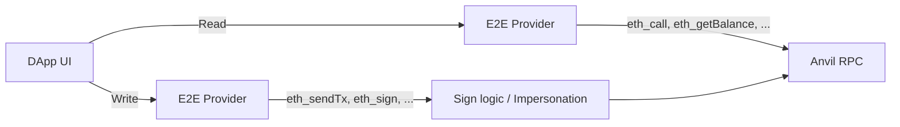

# @wonderland/e2e-connector

Lightweight E2E Provider for Web3 DApps - A virtual EIP-1193 provider that enables deterministic, high-performance E2E testing.

## Overview

This library provides a **"Man-in-the-Middle" injected provider** that sits between your DApp and the network. Instead of interacting with a real wallet extension, the DApp interacts with our custom provider which implements the standard EIP-1193 interface.

### How It Works



**Read operations** (`eth_call`, `eth_getBalance`, etc.) → Forwarded directly to Anvil RPC

**Write operations** (`eth_sendTransaction`, `eth_sign`, etc.) → Routed to local signing logic, then forwarded to Anvil RPC

This keeps **100% chain realism** while maintaining **full control** in tests.

## Advantages

-   **Incredible Test Speed**: No browser extension overhead, controlled RPC latency, fully virtualized wallet interactions
-   **Framework Agnostic**: Works with Cypress, Playwright, Selenium, or any E2E testing tool
-   **Zero External Dependencies**: Built entirely on viem types and native fetch
-   **Total Control**: Simulate edge cases like RPC errors, specific error codes, delayed signatures, chain switching failures
-   **CI/CD Friendly**: Runs effortlessly in headless browsers and Docker containers

## Installation

```bash
pnpm add @wonderland/e2e-connector
```

## Usage

### With Wagmi (Recommended)

The solution uses a standard Wagmi Connector factory, making it "Plug and Play". The DApp does not need to change its code logic, only its configuration:

```typescript
import { e2eConnector } from "@wonderland/e2e-connector";
import { createConfig, http } from "wagmi";
import { mainnet } from "wagmi/chains";

// Anvil's default test private key
const TEST_PRIVATE_KEY = "0xac0974bec39a17e36ba4a6b4d238ff944bacb478cbed5efcae784d7bf4f2ff80";

const isE2E = process.env.NEXT_PUBLIC_E2E_CONNECTOR === "true";

export const config = createConfig({
    chains: [mainnet],
    connectors: isE2E
        ? [
              e2eConnector({
                  rpcUrl: "http://127.0.0.1:8545", // Anvil
                  account: TEST_PRIVATE_KEY,
                  chain: mainnet,
              }),
          ]
        : [
              /* real wallets */
          ],
    transports: {
        [mainnet.id]: http("http://127.0.0.1:8545"),
    },
});
```

✅ No browser extension  
✅ No HTTP interception  
✅ No mocks needed  
✅ Pure Anvil execution

### Standalone Provider

```typescript
import { createE2EProvider } from "@wonderland/e2e-connector";
import { mainnet } from "viem/chains";

const provider = createE2EProvider({
    rpcUrl: "http://127.0.0.1:8545",
    chain: mainnet,
    account: "0xac0974bec39a17e36ba4a6b4d238ff944bacb478cbed5efcae784d7bf4f2ff80",
    debug: true,
});

// Use the provider directly
const accounts = await provider.request({ method: "eth_requestAccounts" });
const balance = await provider.request({
    method: "eth_getBalance",
    params: [accounts[0], "latest"],
});
```

### Test Control Functions

```typescript
import { disconnect, setAccounts, setChain } from "@wonderland/e2e-connector";

// Update accounts during test
setAccounts(provider, ["0xNewAddress..."]);

// Switch chain
setChain(provider, 1); // mainnet

// Disconnect
disconnect(provider);
```

## Method Routing

### Read Methods → Anvil RPC

These methods are forwarded directly to the configured RPC URL:

-   `eth_call`, `eth_getBalance`, `eth_getCode`, `eth_getStorageAt`
-   `eth_blockNumber`, `eth_getBlockByHash`, `eth_getBlockByNumber`
-   `eth_getTransactionReceipt`, `eth_getTransactionByHash`
-   `eth_gasPrice`, `eth_estimateGas`, `eth_feeHistory`
-   `eth_getLogs`, `eth_getFilterLogs`
-   And more...

### Write Methods → Local Signing → Anvil RPC

These methods are handled locally with viem's wallet client:

-   `eth_sendTransaction` - Signed locally, sent to Anvil
-   `personal_sign` - Signed locally
-   `eth_signTypedData_v4` - Signed locally
-   `eth_sign` - Signed locally

### Wallet Methods → Local State

These methods are handled by local provider state:

-   `eth_accounts`, `eth_requestAccounts`
-   `eth_chainId`, `net_version`
-   `wallet_switchEthereumChain`, `wallet_addEthereumChain`

## Test Runner Integration

### Cypress Example

```typescript
// cypress/e2e/swap.cy.ts
describe("Token Swap", () => {
    beforeEach(() => {
        // Start Anvil fork before tests
        cy.task("startAnvil", { forkUrl: process.env.MAINNET_RPC });
    });

    it("should swap tokens successfully", () => {
        cy.visit("/swap");

        // The E2E connector auto-connects
        cy.get('[data-testid="token-input"]').type("1.0");
        cy.get('[data-testid="swap-button"]').click();

        // Transaction is signed locally and sent to Anvil
        cy.get('[data-testid="success-message"]').should("be.visible");
    });
});
```

### Playwright Example

```typescript
// tests/swap.spec.ts
import { expect, test } from "@playwright/test";

test("should swap tokens", async ({ page }) => {
    await page.goto("/swap");

    await page.fill('[data-testid="token-input"]', "1.0");
    await page.click('[data-testid="swap-button"]');

    // Transaction is automatically signed and executed
    await expect(page.locator('[data-testid="success-message"]')).toBeVisible();
});
```

## Configuration

### E2EConnectorParameters (Wagmi)

| Parameter | Type             | Required | Description                                 |
| --------- | ---------------- | -------- | ------------------------------------------- |
| `rpcUrl`  | `string`         | Yes      | Anvil RPC URL (e.g., http://127.0.0.1:8545) |
| `account` | `Hex \| Account` | Yes      | Private key or viem Account for signing     |
| `chain`   | `Chain`          | Yes      | Chain configuration                         |
| `debug`   | `boolean`        | No       | Enable debug logging                        |

### E2EProviderConfig (Standalone)

| Parameter | Type             | Required | Description                             |
| --------- | ---------------- | -------- | --------------------------------------- |
| `rpcUrl`  | `string`         | Yes      | Anvil RPC URL                           |
| `chain`   | `Chain`          | Yes      | Chain configuration                     |
| `account` | `Hex \| Account` | Yes      | Private key or viem Account for signing |
| `debug`   | `boolean`        | No       | Enable debug logging                    |

## Final Result

With this library you get:

-   A **real blockchain** (Anvil fork)
-   A **virtual wallet** (local signing)
-   A **deterministic environment** (no external dependencies)
-   A **super-fast E2E stack** (no browser extension overhead)
-   **Zero dependency on Metamask** or fake endpoints

This is as close as you can get to **production behavior** with **testing-level control**.

## Development

```bash
# Install dependencies
pnpm install

# Build
pnpm build

# Run tests
pnpm test

# Lint
pnpm lint

# Format
pnpm format:fix
```

## License

MIT License - see [LICENSE](LICENSE) for details.

## Contributing

Contributions are welcome! Please read our contributing guidelines before submitting a PR.
